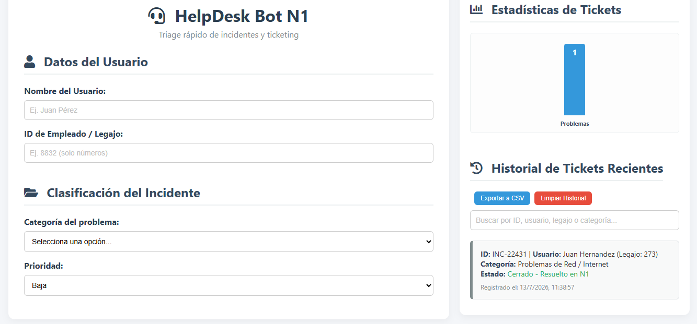

# 🤖 HelpDesk Bot N1 - Customer Task Manager

<!-- Imagen de presentación/Banner del proyecto -->


## 📌 Sobre el Proyecto
Este proyecto es un **Asistente de Soporte Técnico de Nivel 1 (Help Desk)** interactivo desarrollado con **HTML, CSS y JavaScript**. 

Combina la lógica de atención al cliente de una Mesa de Ayuda real con la estructura de datos típica de la Ciencia de Datos. Permite registrar usuarios, realizar un triage (diagnóstico rápido) de problemas comunes (Red, Contraseñas, Hardware) y generar tickets con una estructura formal lista para ser almacenada en una base de datos.

---

## 🛠️ Tecnologías Utilizadas
* **HTML5** - Estructura del sitio web y formularios.
* **CSS3** - Diseño moderno, responsivo y adaptado para el agente de soporte.
* **JavaScript (ES6)** - Lógica dinámica para la selección de pasos de triage, simulación de base de datos local y generación de IDs únicos de tickets.

---

## 💾 Estructura del Ticket (Modelo de Datos)
Cada incidente resuelto o escalado genera un objeto estructurado que emula una fila en una base de datos MySQL:
{
  "id_ticket": "INC-48219",
  "fecha_creacion": "2026-07-13 21:10:00",
  "usuario_nombre": "Esteban Quito",
  "usuario_legajo": "EMP-4421",
  "categoria": "Problemas de Red / Internet",
  "prioridad": "Alta",
  "estado": "Cerrado - Resuelto en N1",
  "resolucion_automatica": 1
}

---

## 🚀 Cómo Ejecutar el Proyecto Localmente

No necesitas instalar dependencias complicadas ni servidores locales. Al ser un desarrollo puramente Front-end, solo sigue estos pasos:

1. **Clona el repositorio** en tu computadora:
   ```bash
   git clone [https://github.com/caroladonadio/customer-task-manager.git](https://github.com/caroladonadio/customer-task-manager.git)
